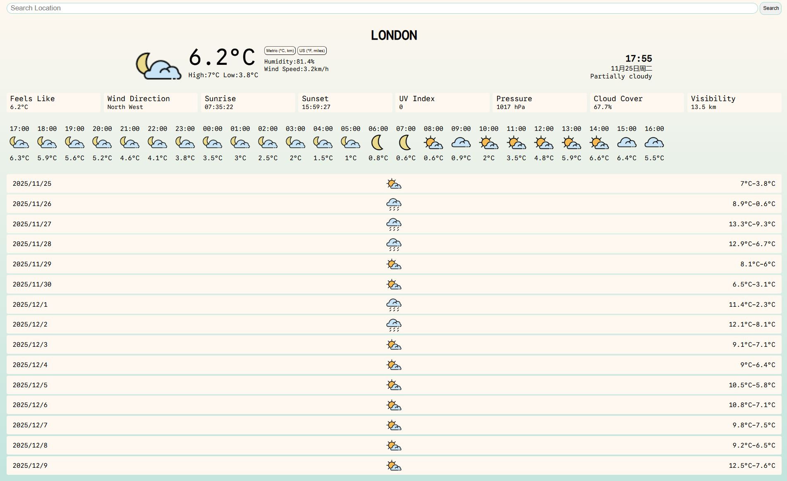

# Weather App

Weather App project from The Odin Project Curriculum.

[Live Demo](https://weizhixie.github.io/weather-app/)

## Features

- Enter a location name or postcode to fetch real-time weather information using the Visual Crossing Weather API.

- Dynamically update the weather icon based on the current weather conditions.

- Display the 15-day forecast and the next 24-hour weather information.

## Getting Started

### Prerequisites

You need to have Node.js and npm installed on your machine.

First install all required packages with:

```
npm install
```

You can run the app in development mode. In this mode, pages reload automatically when you make changes, and errors are displayed as they occur:

```
npm run dev
```

Alternatively, build the app in production mode to bundle the source files into the dist directory. This process optimizes and minifies the files for the best performance, making them ready for deployment:

```
npm run build
```

# Screenshot


